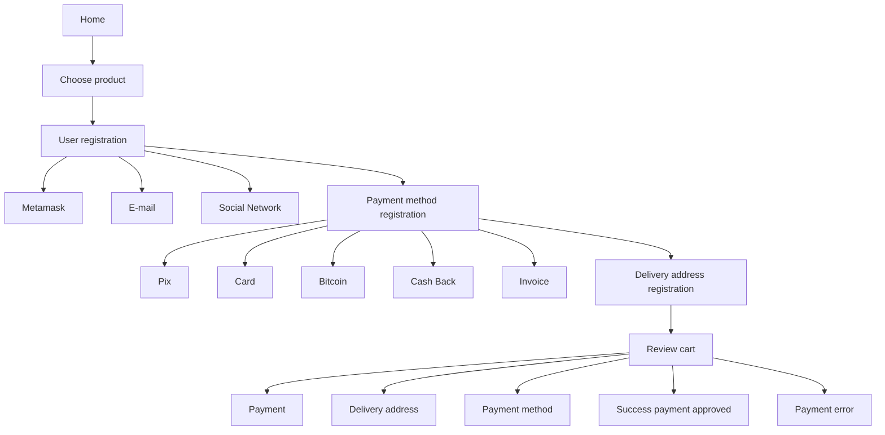
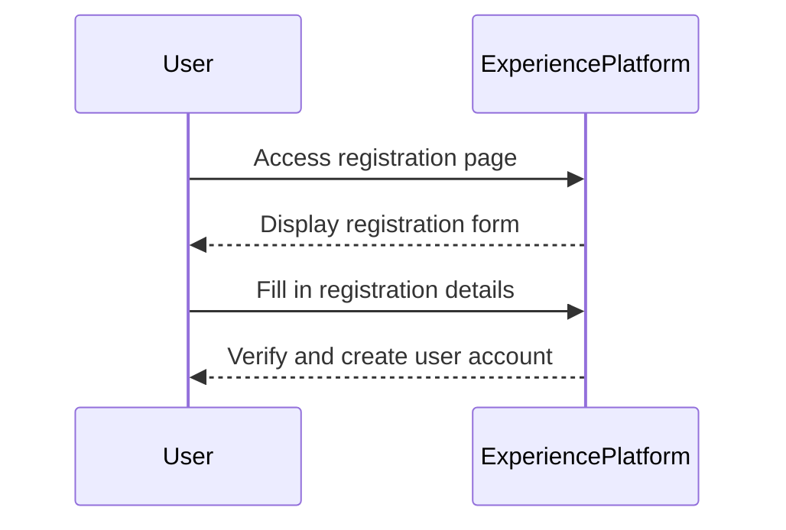
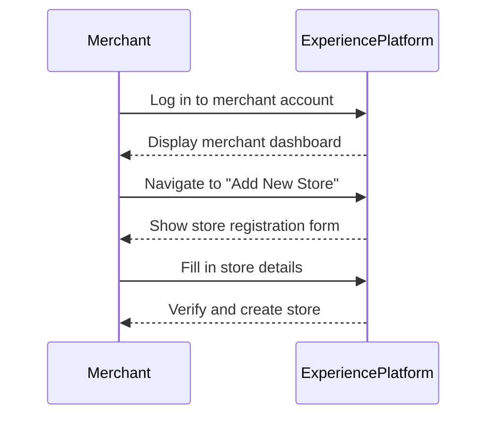
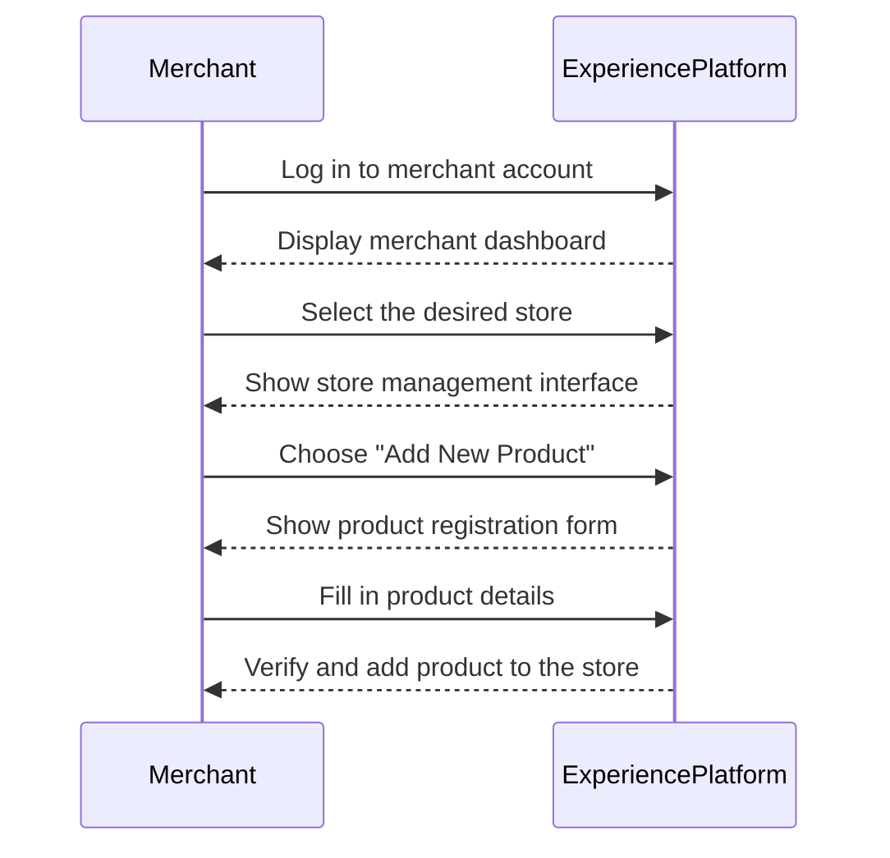
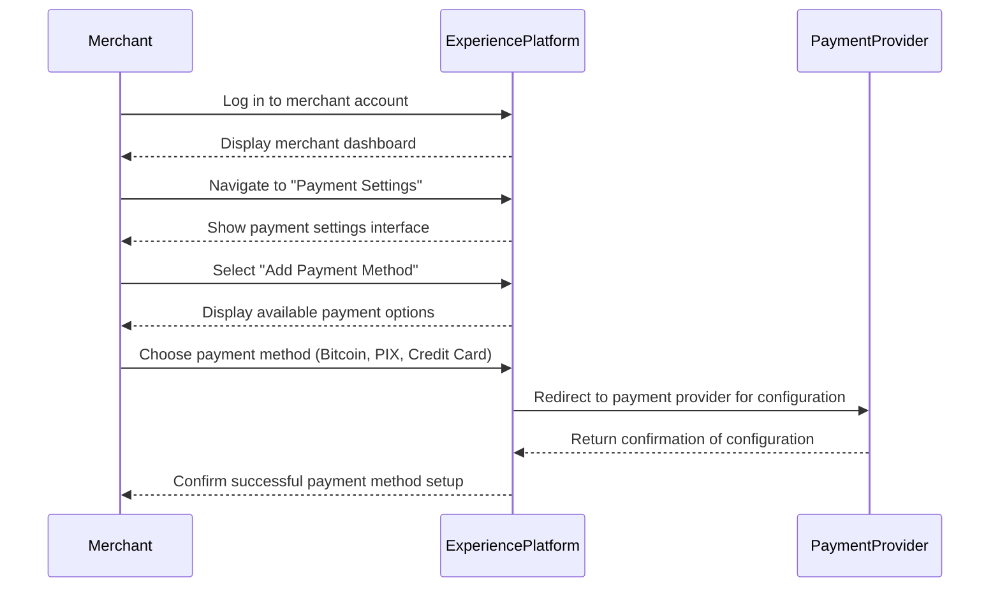
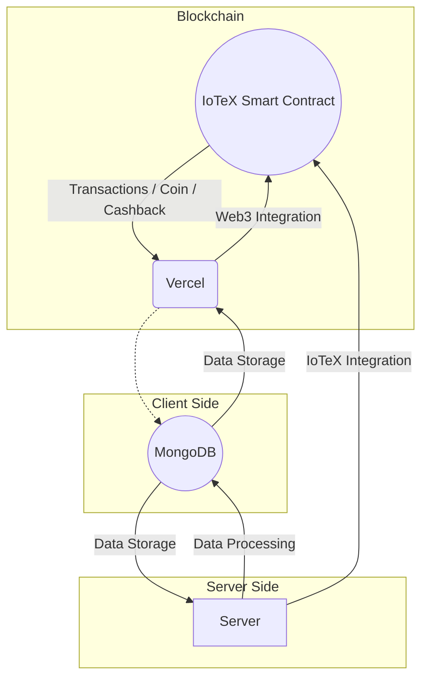
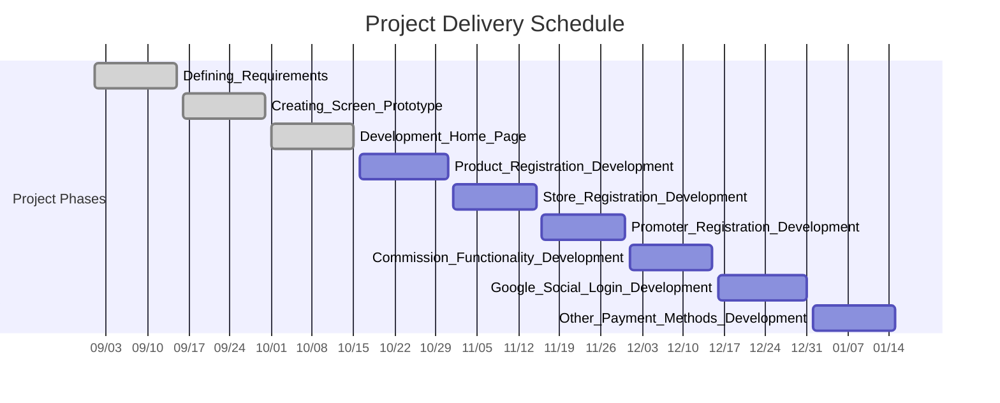

# Experience

    

> Experience is:

* An e-commerce platform where you can create your own store and sell your products in a simple way.

Registration:
    
    - Store
    - Products

* A customer engagement tool:

Modules:

    - Cashback - using its own currency - (backing)
    - Promotion - Products / Coupon / Commission (product/123?seller=ABC) [Ambassador / Promoter]
    - SEO for organic / paid traffic (increase visibility of store / product / showcase / ...)

* Consulting service and personalized support for Companies / Entrepreneurs (School & Consulting)

    - Consulting to improve the experience your customer has with your product
    - Presentation consulting (service / product)
    - Economic viability analysis (service / product) (clarity for the scenario)

Experience is an innovative platform that aims to assist merchants in offering products and services intelligently and efficiently. Inspired by the TV series "Fantasy Island," the platform allows customers to live out their fantasies and dreams through unique and personalized experiences. Here, merchants can register unique experiences that customers can enjoy, creating an ecosystem of service and product exchange.

---

## Mission

Our mission at Experience is to create a space where merchants can offer unique and memorable experiences to their customers. We want to facilitate the connection between people and experiences, allowing customers to discover new ways to enjoy life and merchants to expand their businesses efficiently and innovatively.

---

## Vision

Our vision is to be the leading platform in connecting people to unique and innovative experiences worldwide. We want to be recognized as a community that values quality, innovation, and collaboration between merchants and customers.

---

## Purpose

Our purpose is to enrich people's lives through memorable experiences. We believe that each experience is an opportunity to learn, grow, and connect with others. We want every customer who uses Experience to feel that their life has been enriched in some way.

---

## Customer

Our customers are curious and adventurous individuals who are always looking for new experiences to enrich their lives. They value quality, authenticity, and innovation, and are always ready to try something new.

---

## Supplier

Our suppliers are passionate and talented merchants who are eager to share their unique experiences with the world. They are innovators, creative, and committed to excellence in everything they do.

---

## Kind Organizers (Promoter)

Our kind organizers are the facilitators who make everything possible. They are responsible for ensuring that each experience is perfectly organized and managed, and that each customer leaves satisfied.

---

## About Experience

Experience is more than a platform; it's a community. Here, merchants of all kinds can offer amazing experiences to their customers. Whether it's a gourmet dinner, a sightseeing tour, a dance class, a craft beer tasting, or any other experience you can imagine, Experience is the place to share it.

---

## How Experience Works

Experience is designed to help you, the merchant, create, organize, and manage the best experiences your customers can have. With your talent and our organization, the sky is the limit. Through our platform, you can manage your offerings, track customer interest, and receive valuable feedback that can help further improve your experiences.

## User Journeys

Initial journey, unregistered user:

Certainly! Let's create diagrams in Mermaid to explain each of the actions mentioned in English.

### 1. Register a user

### 2. How to register a store

### 3. How to add products

### 4. How to set up payment methods (Bitcoin, PIX, Credit Card)

---

## Arq 

In this diagram:

- **FE (Vercel)** represents the frontend hosted on Vercel.
- **Web3** represents the integration with Web3 for interacting with IoTeX smart contracts.
- **MongoDB** is used for data storage and is accessed by both the frontend and backend.
- **BE (Server)** represents the backend server, interacting with MongoDB and integrating with IoTeX through Web3 for transactions and other blockchain-related functionalities.

---

## Timeline

1 - Requirement Definition (Status: Done)
2 - Screen Prototype Creation (Status: Done)
3 - Development of Home page / Login via metamask / Products / Purchase Flow (payment in ETH test) (Status: Done)
4 - Product Registration Development
5 - Store Registration Development
6 - Promoter Registration Development
7 - Commission Functionality Development
8 - Login Development via Google / Social Network
9 - Development of other payment methods (Pix, Card, Bitcoin)

## Join Us

We are always looking for talented and passionate merchants to join our community. If you believe you can offer amazing experiences to your customers and want to be part of a collaborative network of merchants, join us at Experience.

---

## Social Action - Social and Environmental Projects

At Experience, we believe that everyone has the right to enjoy amazing experiences. That's why we are committed to supporting social and environmental projects that help make the world a better place. With every experience booked, a percentage is donated to projects that support needy communities and sustainability initiatives.

---

## Contact

For more information, please contact us through our website or send an email to [email].

---

Experience - With your talent and our organization, the sky is the limit.