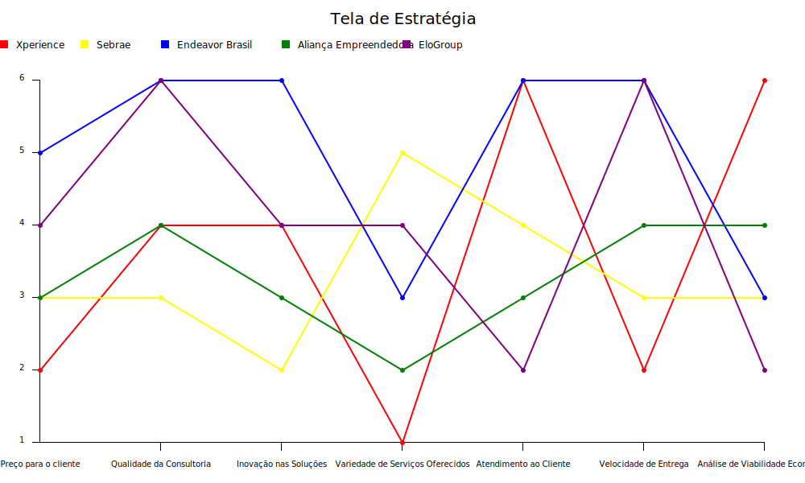

# Strategy Canvas

## Fator Competitivo

1. Preço dos Serviços
• Descrição: O custo total dos serviços oferecidos, comparado aos concorrentes.
2. Qualidade da Consultoria
• Descrição: A eficácia e a profundidade das estratégias de inovação e consultoria fornecidas.
3. Inovação nas Soluções
• Descrição: A capacidade de criar soluções únicas e inovadoras que se destacam no mercado.
4. Variedade de Serviços Oferecidos
• Descrição: A gama de serviços e consultorias disponíveis para diferentes necessidades empresariais.
5. Experiência e Reputação
• Descrição: A reputação da empresa no mercado e a experiência acumulada em consultoria.
6. Atendimento ao Cliente
• Descrição: A qualidade e a personalização do suporte e atendimento oferecidos aos clientes.
7. Capacitação e Treinamento
• Descrição: A abrangência e a eficácia dos programas de treinamento e workshops oferecidos.
8. Velocidade de Entrega
• Descrição: A rapidez e a eficiência na entrega de serviços e projetos.
9. Análise de Viabilidade Econômica
• Descrição: A precisão e o detalhamento das análises econômicas e de viabilidade.
10. Sustentabilidade e Responsabilidade Social
• Descrição: O compromisso da empresa com práticas sustentáveis e responsabilidade social.
11. Parcerias Estratégicas
• Descrição: A capacidade de formar parcerias estratégicas que agregam valor aos serviços oferecidos.

## Concorrentes

1. **Endeavor Brasil**
   - **Produtos/Serviços**:
     - **Mentoria para empreendedores de alto impacto**: Conexão com mentores experientes do mercado para orientações estratégicas.
     - **Programas de aceleração de startups**: Programas como o Scale-Up Endeavor, focados em acelerar o crescimento de startups promissoras.
     - **Recursos e conteúdos educacionais sobre empreendedorismo**: Artigos, webinars, e cursos online sobre temas relevantes para empreendedores.

2. **Sebrae (Serviço Brasileiro de Apoio às Micro e Pequenas Empresas)**
   - **Produtos/Serviços**:
     - **Consultoria empresarial**: Atendimento especializado para micro e pequenas empresas em diversas áreas, como gestão financeira, marketing, e inovação.
     - **Cursos e capacitações**: Ofertas de cursos presenciais e online em áreas como empreendedorismo, gestão, e inovação.
     - **Programas de acesso a crédito**: Orientação e apoio para acesso a linhas de crédito e financiamento para pequenos negócios.
     - **Ferramentas de gestão**: Softwares e ferramentas para melhorar a gestão empresarial, como sistemas de controle financeiro e de planejamento estratégico.

3. **Aliança Empreendedora**
   - **Produtos/Serviços**:
     - **Consultoria para microempreendedores e pequenos negócios**: Apoio na formalização e desenvolvimento de pequenos negócios, especialmente em comunidades vulneráveis.
     - **Programas de capacitação**: Treinamentos focados em habilidades empreendedoras e gestão de negócios.
     - **Parcerias estratégicas**: Colaborações com empresas e ONGs para oferecer suporte adicional a empreendedores de baixa renda.

4. **Startup Weekend**
   - **Produtos/Serviços**:
     - **Eventos de 54 horas**: Fins de semana intensivos onde os participantes criam e lançam startups do zero.
     - **Mentoria e suporte**: Orientação de mentores experientes durante os eventos para ajudar no desenvolvimento das ideias.
     - **Networking**: Oportunidade de conexão com outros empreendedores, investidores, e profissionais do mercado.

5. **EloGroup**
   - **Produtos/Serviços**:
     - **Consultoria em estratégia empresarial e inovação**: Desenvolvimento de estratégias personalizadas para promover inovação e crescimento nas empresas.
     - **Excelência operacional**: Implementação de práticas e metodologias para otimizar processos e aumentar a eficiência.
     - **Transformação digital**: Projetos de digitalização de processos e adoção de novas tecnologias para melhorar a competitividade empresarial.

6. **Anjos do Brasil**
   - **Produtos/Serviços**:
     - **Conexão com investidores anjo**: Plataforma que conecta startups em busca de capital com investidores dispostos a investir em novos negócios.
     - **Mentoria para startups**: Suporte e orientação para ajudar empreendedores a desenvolverem seus negócios e se prepararem para receber investimentos.
     - **Eventos e workshops**: Encontros e eventos educativos sobre investimento anjo e estratégias de crescimento para startups.

7. **GSVlabs**
   - **Produtos/Serviços**:
     - **Programas de aceleração**: Suporte intensivo para startups em fase inicial ou de crescimento, com foco em acelerar seu desenvolvimento e sucesso.
     - **Espaços de coworking**: Infraestrutura moderna e colaborativa para startups e empresas em crescimento trabalharem.
     - **Recursos para inovação**: Acesso a mentores, investidores, e uma rede de apoio para fomentar a inovação e o crescimento empresarial.

## Concorrentes e Produtos/Serviços

### Lista de Consultorias de Empreendedorismo, Seus Principais Produtos e Preços Estimados

1. **Endeavor Brasil**
   - **Mentoria para empreendedores de alto impacto**: R$ 10.000 - R$ 30.000 por programa de mentoria.
   - **Programas de aceleração de startups**: R$ 20.000 - R$ 50.000 por programa.
   - **Recursos e conteúdos educacionais sobre empreendedorismo**: Gratuito a R$ 2.000 dependendo do curso ou material.

2. **Sebrae (Serviço Brasileiro de Apoio às Micro e Pequenas Empresas)**
   - **Consultoria empresarial**: R$ 1.000 - R$ 5.000 por mês, dependendo da complexidade.
   - **Cursos e capacitações**: R$ 100 - R$ 1.500 por curso.
   - **Programas de acesso a crédito**: Gratuito.
   - **Ferramentas de gestão**: R$ 500 - R$ 2.000 por licença.

3. **Aliança Empreendedora**
   - **Consultoria para microempreendedores e pequenos negócios**: Gratuito a R$ 500 por sessão.
   - **Programas de capacitação**: R$ 100 - R$ 1.000 por programa.
   - **Parcerias estratégicas**: Gratuito para empreendedores, custos cobertos por parcerias.

4. **Startup Weekend**
   - **Eventos de 54 horas**: R$ 300 - R$ 800 por participante.
   - **Mentoria e suporte**: Incluído no custo do evento.
   - **Networking**: Incluído no custo do evento.

5. **EloGroup**
   - **Consultoria em estratégia empresarial e inovação**: R$ 10.000 - R$ 50.000 por projeto.
   - **Excelência operacional**: R$ 15.000 - R$ 40.000 por projeto.
   - **Transformação digital**: R$ 20.000 - R$ 70.000 por projeto.

6. **Anjos do Brasil**
   - **Conexão com investidores anjo**: Taxa de sucesso de 2% - 5% sobre o valor do investimento.
   - **Mentoria para startups**: Gratuito a R$ 5.000 por programa de mentoria.
   - **Eventos e workshops**: R$ 200 - R$ 1.000 por evento.

7. **GSVlabs**
   - **Programas de aceleração**: R$ 20.000 - R$ 60.000 por programa.
   - **Espaços de coworking**: R$ 500 - R$ 2.500 por mês, dependendo do plano.
   - **Recursos para inovação**: Variável, baseado nos serviços específicos solicitados.
